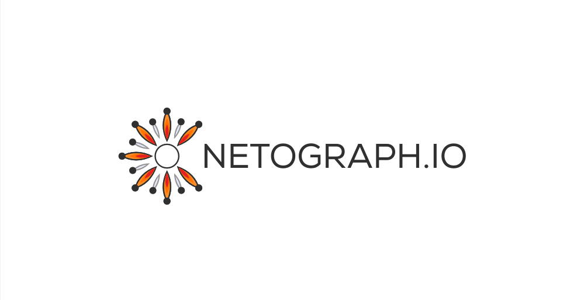

This repository contains a command-line tool and language packs for interacting
with the Netograph API.

# ngc: Netograph command-line interface

**ngc** is a command-line tool that exposes the complete Netograph interface for
interactive use. If you have a Go development environment set up, you can
install it as follows:

```sh
go get -u github.com/netograph/netograph-api/go/cmd/ngc
```

Alternatively, binaries for all major platforms can be downloaded from [the
latest release
page](https://github.com/netograph/netograph-api/releases/latest).

After installation, try running `ngc` for a high-level overview of the API, and
`ngc help command` for help on any specific command.

## Configuration

**ngc** is configured through environment variables.

| Variable | Description |
| --- | --- |
| NGC_DATASET | The dataset to operate on, unless over-ridden with the `--dset` flag. Defaults to `netograph:social`, our largest public data repository
| NGC_TOKEN  | The authentication token for API access. Can be over-ridden with the `--token` command-line flag.  |


## Output formats

By default **ngc** outputs data in an easy-to-read text format. There are two
other formats available - indented JSON (the `--json` flag) and compact JSON
(the `--cjson` flag). Compact JSON consists of one record per line with no
newlines, and so is suitable for programmatic use.


## Examples

Begin by exporting your access token:

```sh
export NGC_TOKEN=MYTOKEN
```

You can now list the datasets that you have access to:

```sh
ngc datasets
```

Note that public datasets will be marked read-only. You can query these, but not
submit new URLs to be captured to them. For datasets you have write access to,
see the `ngc submitcapture` command for capture submission.

The default dataset is the `netograph:social` dataset, which aggregates a
sizeable fraction of all URLs passing through social media in real time. As a
first step, let's list all the satellites we've ever seen for a domain query.

```sh
ngc satellitesforroot rt.com
```

There are a few things to note here.

- This command searches for rt.com and ALL its subdomains. See the [Domain
  Queries](#domain-queries) section for a description of how to restrict to a
  specific domain.
- The output is pretty verbose, and it would be nice to be able to extract only
  the information we're interested in. We recommend
  [jq](https://stedolan.github.io/jq/), a light-weight command-line JSON
  processor for this.
- The command name is pretty long. Most commands have shorter aliases you can
  view using `ng help`.
- By default we limit the number of responses for queries to 100. It's pretty
  easy to craft a command that will return millions of records. In this case, we
  want to list ALL of the satellites we've ever seen on `rt.com`, and we can
  disable this limit by setting it to `0`.

Putting all of this together, we have a command like this:

```sh
ngc -n 0 --cjson satsforroot  | jq -r .satelite
```

At the time of writing, this command cleanly lists about 3600 third-party
domains for `rt.com`.


# Language packs


## Go

You may install the Netograph Go library with the following command:

```sh
go get -u github.com/netograph/netograph-api/go
```

Please see the source for the **ngc** tool in this repo for a comprehensive
usage example.


## Python

You can install the current release from the PyPi registry as follows:

```sh
pip install netograph
```

To install the development version of the library, check out this repo, and type:

```sh
pip install ./python
```

Both of these commans will install the `netograph` Python module. See the
examples within the Python directory for usage.


# API Notes

## Domain queries

When dealing with domains, the Netograph API usually accepts domain queries
rather than specific domains. This means that a query for `rt.com` will also
return results for `www.rt.com`, `social.rt.com` and so forth. You can restrict a
query strictly to a specified domain by prefixing it with "$". So, a query for
"$rt.com" will match no subdomains.

Note that "$" is syntactically significant to most shells, even within quoted
strings. You'll need to escape it when using **ngc**, e.g.:

```sh
ngc ipsfordomain "\$rt.com"
```


## Resume tokens

Netograph has an efficient streaming API - queries that return thousands or
hundreds of thousands of records are permitted and common. In most cases, each
record comes with a **resume token**, which can be passed in queries to resume
streaming if a connection was lost, or to provide functionality like paging.
Resume tokens are only valid when passed to the exact same query that originated
them, and should not be stored persistently.

